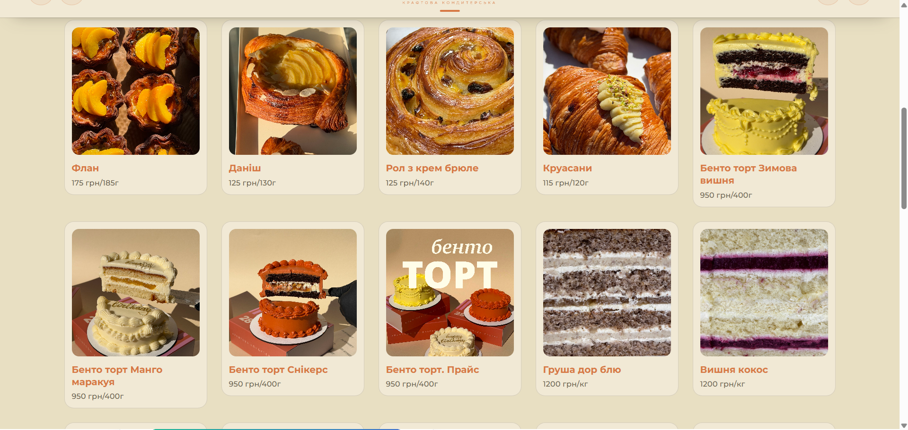
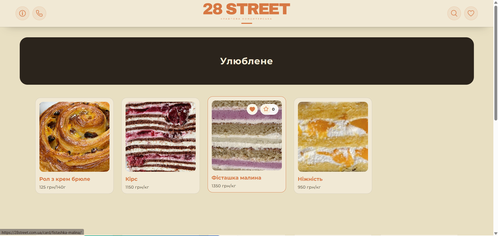
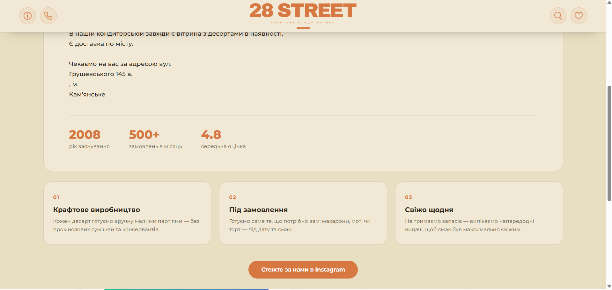

# 28-Street
https://28street.com.ua/

A modern website for a local bakery in Ukraine.

## 🚀 Features

- Responsive design
- Django backend
- SEO optimization
- Mobile-friendly design
- Favorites system
- Like counter
-  Gunicorn application server
- Nginx reverse proxy
  
## 🛠 Tech Stack

- Python
- Django
- HTML
- CSS
- JavaScript
- Bootstrap

## 📸 Screenshots

  
  
  
  

  
## ⚙️ Installation

```bash
git clone https://github.com/Nikits569/28-street.git
cd 28street/main
pip install -r requirements.txt
python manage.py migrate
python manage.py runserver
```

## 👤 Author

Mykyta Pustovoitov
